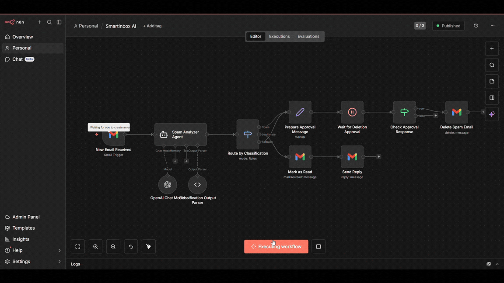

# ⚡ SmartInbox AI: The Intelligent Email Gatekeeper


 


 


---

## 📑 Table of Contents
- [⚡ SmartInbox AI: The Intelligent Email Gatekeeper](#-smartinbox-ai-the-intelligent-email-gatekeeper)
- [🌪️ The Problem](#️-the-problem)
- [💡 The Solution: SmartInbox AI](#-the-solution-smartinbox-ai)
  - [🛠️ The Tech Stack](#️-the-tech-stack)
- [🎮 Live Visual Workflow](#-live-visual-workflow)
- [🧠 Strategic Logic Flow](#-strategic-logic-flow)
  - [1. Ingestion & Analysis](#1-ingestion--analysis)
  - [2. The Decision Engine](#2-the-decision-engine)
  - [3. The Human-in-the-Loop Edge](#3-the-human-in-the-loop-edge)
- [🚀 Quick Start Importing the Flow](#-quick-start-importing-the-flow)
- [💡 Why This Project](#-why-this-project)
- [🔧 Use Cases](#-use-cases)
- [📊 Workflow Details](#-workflow-details)
- [🌐 Socials](#-socials)

---

## 🌪️ The Problem
We receive **120+ emails daily**. 80% are noise. Traditional filters are "dumb"—they either miss sophisticated phishing or accidentally archive important client communications.

## 💡 The Solution: SmartInbox AI
An autonomous **Human-in-the-Loop (HITL)** orchestration that uses LLMs to think like a personal assistant. It doesn't just filter; it **reasons** through content to determine intent.

### 🛠️ The Tech Stack
* **Orchestration:** LangFlow / Flowise (LLM Workflow Builder)
* **Brain:** OpenAI GPT-4o Model
* **Integrations:** Gmail API (OAuth 2.0)
* **Logic:** Custom JSON Output Parsing & Conditional Routing

---

## 🎮 Live Visual Workflow

<div align="center">
  
  <p><i>Real-time execution of the AI Agent analyzing and routing incoming traffic.</i></p>
</div>

---

## 🧠 Strategic Logic Flow

### 1. Ingestion & Analysis
The flow triggers on every new Gmail thread. The **Spam Analyzer Agent** extracts the intent, urgency, and sender credibility.

### 2. The Decision Engine
Using a **Routing Node**, the system forks into three distinct outcomes based on the AI's classification:

| Outcome | Action taken | Security Level |
| :--- | :--- | :--- |
| **🚨 Spam** | Prepares deletion message & **waits for human approval**. | High |
| **✅ Legitimate** | Marks as Read + Triggers an AI-generated draft reply. | Low |
| **⚠️ Fallback** | Keeps in Inbox for manual review (Safety Net). | Critical |

### 3. The "Human-in-the-Loop" Edge
Unlike basic scripts, this project features a **Wait for Approval** node. This demonstrates an understanding of **Enterprise AI Safety**—ensuring the AI never performs a destructive action (deletion) without a final human confirmation.

---

## 🚀 Quick Start (Importing the Flow)

1. **Clone the Repository:**
   ```bash
   git clone https://github.com/manas-shukla-101/SmartInbox-AI.git
   ```
2. **Import JSON Configuration:**
   - Open your dashboard (LangFlow/Flowise).
   - Click Upload/Import and select the [SmartInbox-AI](SmartInbox-AI.json) file.
3. **Connect API Credentials:**
   - Input your _OPENAI_API_KEY_ or _change it to gemini model and use Gemini API_.
   - Authenticate the Gmail Trigger node via Google Cloud Console.
4. **Deploy:**
   - Hit Publish. Your agent is now live.

---

## 💡 Why This Project?

This project demonstrates:

- **AI Integration**: Real-world OpenAI implementation
- **Workflow Design**: Complex logic with approval gates
- **Error Prevention**: Human-in-the-loop for critical actions
- **Scalability**: Modular nodes for easy extension
- **Best Practices**: Clean separation of concerns

## 🔧 Use Cases

- Personal email management
- Business spam filtering
- Automated customer support
- Email workflow automation
- AI prototype testing

## 📊 Workflow Details

| Node | Function | Type |
|------|----------|------|
| Gmail Trigger | Listens for new emails | Trigger |
| SpamAnalyzer | Classifies content | AI Agent |
| Route by Classification | Directs flow | Router |
| Manual Approval | Human verification | Approval |
| Delete Spam | Removes spam | Action |
| Mark as Read | Processes legitimate | Action |
| Send Reply | Auto-responds | Action |

---


---

**Made with ❤️ by Manas Shukla**

---

## 🌐 Socials:
[](https://manas-shukla-portfolio.framer.website/) [](https://instagram.com/manas_shukla_101) [](https://linkedin.com/in/manas-shukla-006774370) [](mailto:shuklamanas8928@gmail.com) 

---
